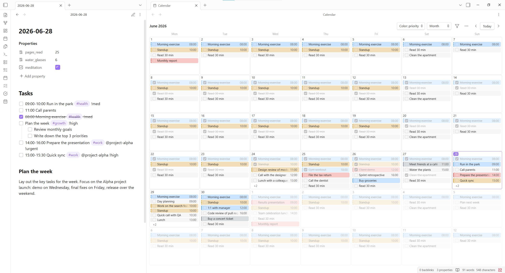
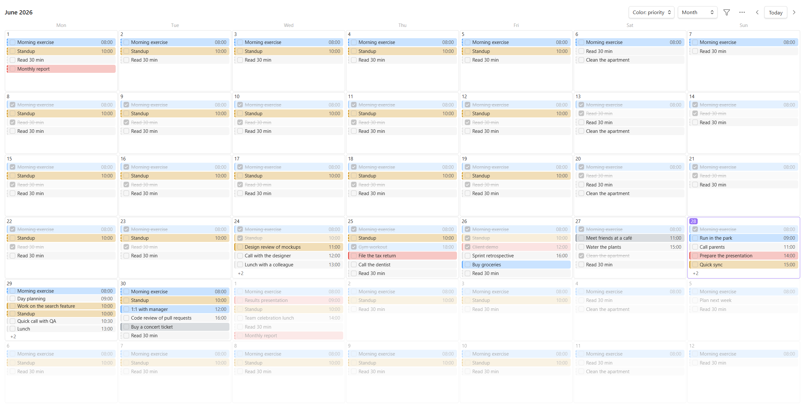
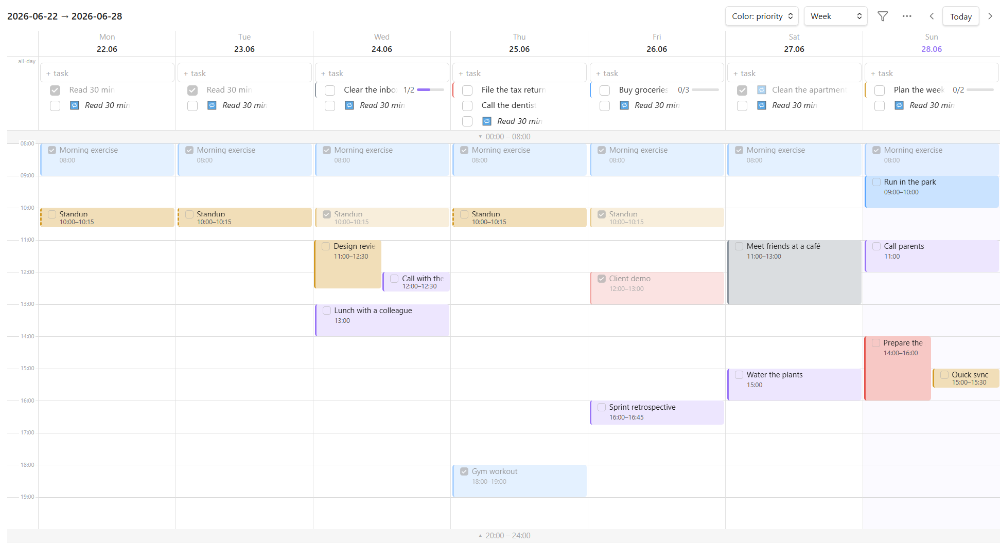
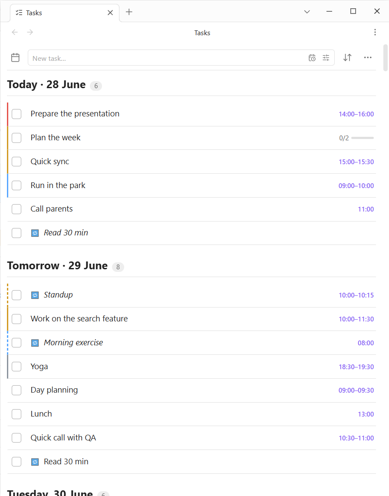
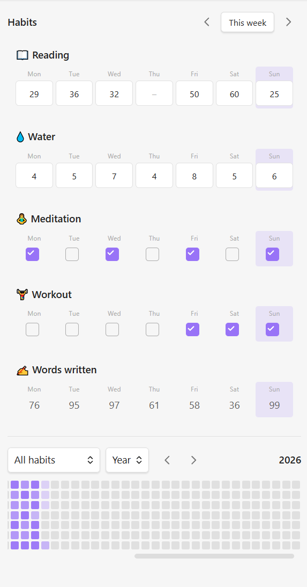
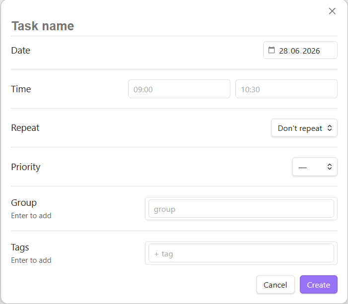
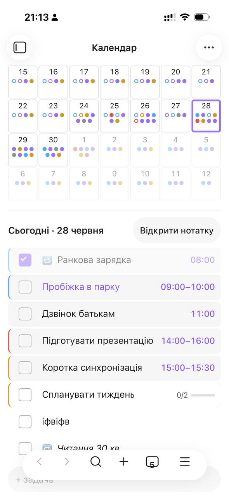

# Markday

A calendar **and** task manager for [Obsidian](https://obsidian.md) that works entirely on top of plain Markdown daily notes. No database, no proprietary format — every task is a normal `- [ ]` checkbox line you can read, edit and sync like any other note.

> 🇺🇦 Interface available in **Ukrainian** and **English** (auto-detected from your Obsidian language, switchable in settings).

> ⚠️ **Beta.** It’s stable enough for daily use, but back up your vault and expect occasional rough edges.

<!-- HERO: split view — the .md source on the left, the rendered calendar/list on the right.
     This is the single most important image: it proves "your tasks are just Markdown". -->


---

## Why

- **Your tasks stay in your notes.** Everything lives in your Daily Notes as ordinary Markdown, so it’s fully visible and editable in Obsidian (and in the Obsidian Tasks/Dataview ecosystems, with minor differences in syntax).
- **One place for time and to‑dos.** Calendar, agenda, timeline, list and habit tracking over the same files.
- **Works on desktop and mobile** (Android/iOS) — the UI adapts to narrow panes and small screens.

---

## Screenshots

### Month calendar
<!-- Calendar view in Month mode, full pane. Use the busy week (22–28) so badges, colors and "today" show. -->


### Timeline (week / 3‑day)
<!-- Week or 3-day timeline with timed events. Caption that events can be dragged to move/resize/create.
     A short GIF here (docs/03-timeline.gif) is far more convincing than a still. -->


### Tasks list
<!-- List view grouped/sorted, including the red "Overdue" section. -->


### Habits
<!-- Habits view: weekly tracker + GitHub-style heatmap + per-habit stats. -->


### Quick create & task editor
<!-- The inline composer with date/recurrence + tag/priority popovers, or the Ctrl/Cmd+P quick-create. -->


### Mobile
<!-- A narrow pane / mobile screenshot showing the floating + button and compact layout. -->


---

## Features

- **Five views**
  - **Smart list** — a mobile-first agenda: quick add, today’s habits, today’s tasks, then the next 7 days.
  - **Calendar** — Month, Overview (dots), Week, Work week and 3‑day modes.
  - **Tasks** — a grouped/sorted task list with filters and an overdue section.
  - **Habits** — a weekly tracker plus a GitHub-style heatmap with per-habit stats.
  - **Mini calendar** — a compact month for the sidebar.
- **Tasks & events** — a task becomes an **event** when it has a time (`14:00` or `14:00-15:30`). The week/3‑day **timeline** lets you drag to move, drag the edges to resize, drag across days, and click-drag on empty space to create.
- **Subtasks & descriptions** — indent a checkbox for a subtask (auto progress + auto‑complete of the parent); add a free‑form description that lives under a per‑task heading (text, images, anything).
- **Recurring tasks** — defined once, projected on the calendar virtually; a real line is written only when you tick a recurrence (no folder full of generated files).
- **Habits** — numeric (e.g. pages, km, minutes) or yes/no, with emoji and color; values are stored in the day note’s frontmatter. Includes an optional built‑in **“words written”** habit that counts words in the day’s note automatically.
- **Organization** — priorities, `#tags`, `@groups`, color rules (by priority/tag/group), filtering, and a configurable colored coding.
- **Quality of life** — quick‑create modal (Ctrl/Cmd+P), inline task composer with date/recurrence and tag/priority popovers, first‑day‑of‑week, working hours, default tag/group/priority, and a floating **+** button on mobile.

---

## Task syntax

Tasks are normal Markdown checkboxes under a configurable heading (default `## Tasks` / `## Задачі`) in each daily note. Metadata is compact:

```markdown
## Tasks
- [ ] 14:00-15:30 Project meeting #work !high @alpha
- [x] Read 30 pages #reading
- [ ] Plan the week !med
    - [ ] Review goals          ← subtask (indented checkbox)
    - A quick note               ← comment (indented bullet)

### Plan the week ^tcd-a1b2c3   ← optional description, linked to the task
Free text, images, links — anything.
```

| Element     | Syntax            | Example          |
|-------------|-------------------|------------------|
| Time/Event  | `HH:MM` / `HH:MM-HH:MM` at the start | `09:00 Standup` |
| Priority    | `!low` `!med` `!high` `!urgent` (customizable) | `!high` |
| Tag         | `#tag`            | `#work`          |
| Group       | `@group`          | `@alpha`         |

Habit values are stored in the day note’s YAML frontmatter, e.g.:

```yaml
---
pages_read: 60
meditation: true
---
```

Recurring-task definitions and habit definitions are stored in the plugin’s settings (`data.json`), not scattered across notes.

---

## Installation (manual / beta)

This plugin is not yet in the community store.

1. Download `main.js`, `manifest.json` and `styles.css` (from a release or by building — see below).
2. Copy them into your vault: `<vault>/.obsidian/plugins/markday/`.
3. Enable **Settings → Community plugins → Markday**.
4. Make sure the core **Daily Notes** plugin is enabled — the calendar reads its folder and date format.

Open a view from the ribbon icons or via the command palette (search “Markday”).

### Try the demo vault

The repository includes `example-vault/` with the plugin pre‑installed and a few weeks of sample data. In Obsidian: **Open folder as vault → example-vault**.

---

## Settings highlights

- **Language** — Auto / Українська / English
- **Heading** level and text used to store tasks
- **Working hours** and **timeline step** (snap)
- **First day of week**
- **Defaults** — default tag, group and priority for new tasks
- **Colors & priorities** — rename priorities, set colors for priorities/tags/groups
- Manage **recurring tasks** and **habits** (create them via Ctrl/Cmd+P; edit/delete here)

---

## Building from source

The source is split into small files under `src/` and concatenated into `main.js`. **No Node.js required** — the build is a PowerShell script:

```powershell
powershell -ExecutionPolicy Bypass -File build.ps1
```

(`styles.css` and `manifest.json` are used directly — only `main.js` is generated.)

---

## Compatibility

- Obsidian 1.4.0+
- Desktop (Windows/macOS/Linux) and mobile (Android/iOS)

---

## License

MIT
